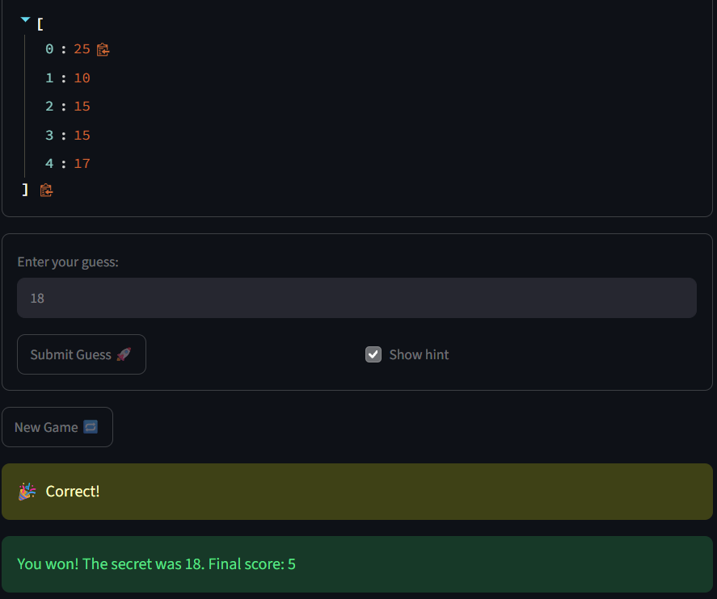

# 🎮 Game Glitch Investigator: The Impossible Guesser

## 🚨 The Situation

You asked an AI to build a simple "Number Guessing Game" using Streamlit.
It wrote the code, ran away, and now the game is unplayable. 

- You can't win.
- The hints lie to you.
- The secret number seems to have commitment issues.

## 🛠️ Setup

1. Install dependencies: `pip install -r requirements.txt`
2. Run the broken app: `python -m streamlit run app.py`

## 🕵️‍♂️ Your Mission

1. **Play the game.** Open the "Developer Debug Info" tab in the app to see the secret number. Try to win.
2. **Find the State Bug.** Why does the secret number change every time you click "Submit"? Ask ChatGPT: *"How do I keep a variable from resetting in Streamlit when I click a button?"*
3. **Fix the Logic.** The hints ("Higher/Lower") are wrong. Fix them.
4. **Refactor & Test.** - Move the logic into `logic_utils.py`.
   - Run `pytest` in your terminal.
   - Keep fixing until all tests pass!

## 📝 Document Your Experience

- [  A guessing game to find a number between a range, and if incorrect
a hint would be given to go higher or lower.
 ] Describe the game's purpose.
- [
   1. enter number in guess input, but it doesn't work, just need to use submit button
have to enter another number to see in history, not after submitted it.
   2. when all the way to 100 still say go higher, did 101 go lower, so answer is broken some how.
   3. history did go past 5 entry logs and new game button not work
   4. the go higher and go lower are pointing opposite directions
   5. hard and normal has their ranges mixed up
 ] Detail which bugs you found.
- [ 
   1. fixed the submit code to connect to enter input
   2. fixed the hints to appear with the reflect the guess range when too high or too low
   3. fixed the history list aspect and added varables to reset when pressing the new game button.
   4. fixed also the hints to point the correct direction of too hig or too low.
   5. edited the range for normal range to be in between easy and hard range.
 ] Explain what fixes you applied.

## 📸 Demo Walkthrough

Describe your fixed game in numbered steps so a reader can follow along without watching a video:

1. User enters a guess of 25
2. Game returns "Too High"
3. User enters a guess of 10, and the game shows "Too Low"
4. User enters a guess of 15, and the game shows "Too Low"
5. User enters a guess of 15, and the game shows "Too Low"
6. User enters a guess of 17, and the game shows "Too Low"
7. Score updates correctly after each guess
9. Game ends after the correct guess

**Screenshot** *(optional)*: <!-- Insert a screenshot of your fixed, winning game here -->


## 🧪 Test Results

```
# Paste your pytest output here, e.g.:
# pytest tests/
# ========================= X passed in 0.XXs =========================
```
============================= test session starts =============================
platform win32 -- Python 3.13.14, pytest-9.1.1, pluggy-1.6.0 -- C:\Users\Lenovo PC\Documents\2026_Fall\AI_110_Foundations_of_AI_Engineering\assignment\ai110-module1show-gameglitchinvestigator-starter\.venv\Scripts\python.exe
cachedir: .pytest_cache
rootdir: C:\Users\Lenovo PC\Documents\2026_Fall\AI_110_Foundations_of_AI_Engineering\assignment\ai110-module1show-gameglitchinvestigator-starter
plugins: anyio-4.15.1
collecting ... collected 5 items

tests/test_game_logic.py::test_winning_guess PASSED                      [ 20%]
tests/test_game_logic.py::test_guess_too_high PASSED                     [ 40%]
tests/test_game_logic.py::test_guess_too_low PASSED                      [ 60%]
tests/test_game_logic.py::test_guess_too_low_across_digit_boundary PASSED [ 80%]
tests/test_game_logic.py::test_guess_too_high_across_digit_boundary PASSED [100%]

============================== 5 passed in 0.06s ==============================


## 🚀 Stretch Features

- [ ] [If you choose to complete Challenge 4, describe the Enhanced UI changes here — a screenshot is optional]
